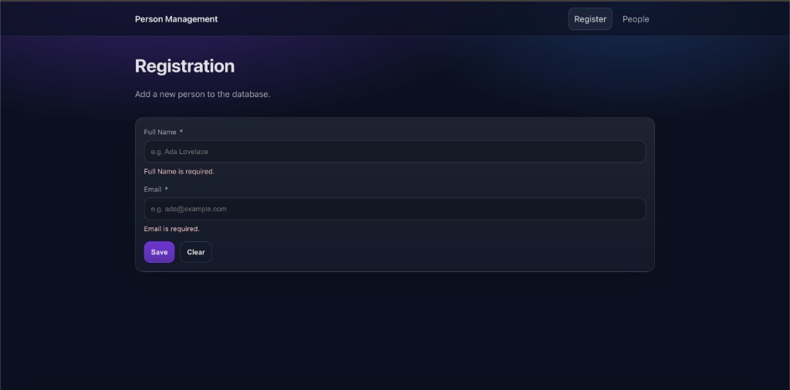
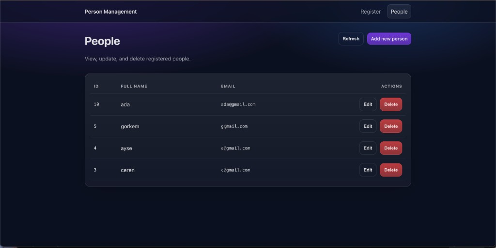
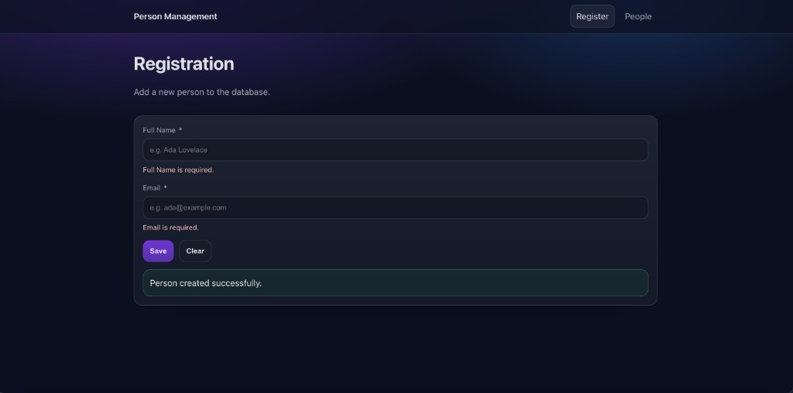
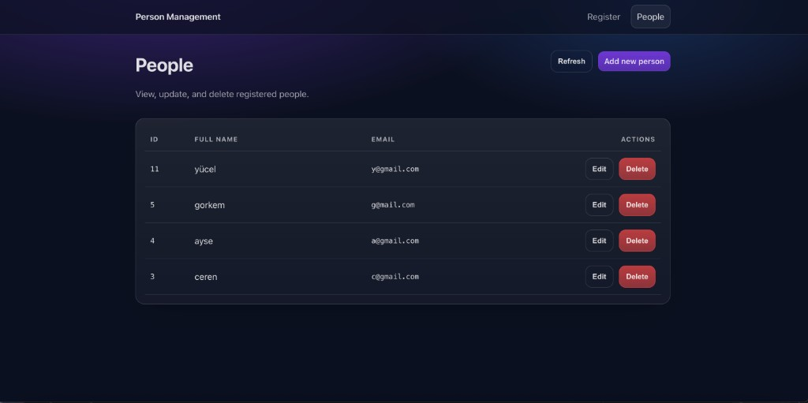
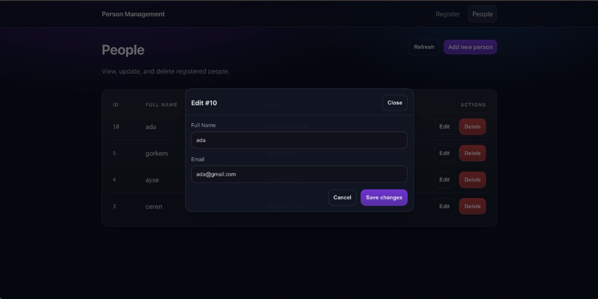
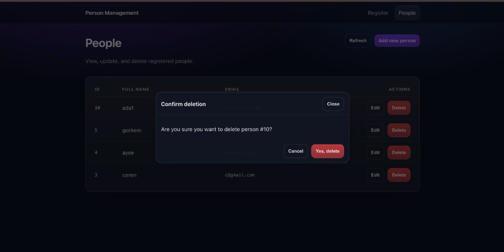
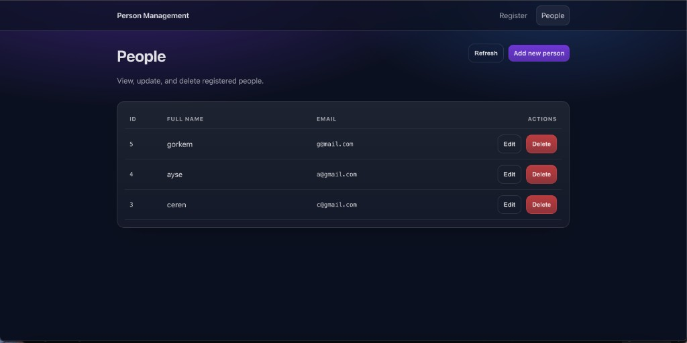
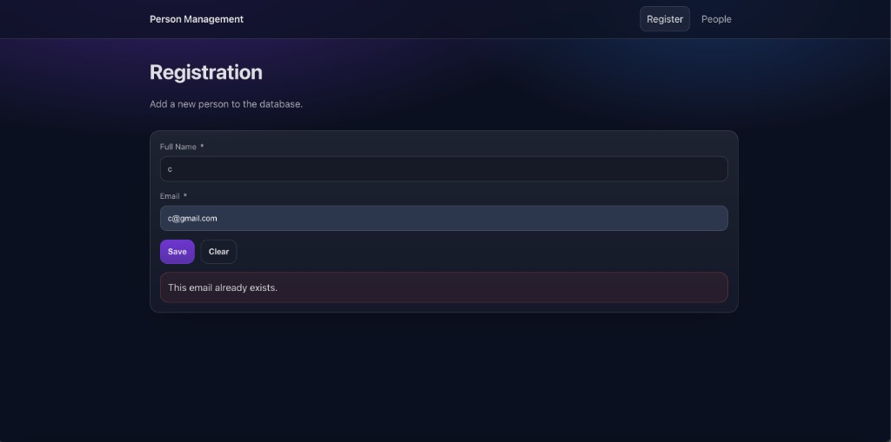

# Person Management System

Full-stack web application built with **React + Node.js (Express) + PostgreSQL** and containerized with **Docker Compose**.

## Project Description

This project is a simple Person Management System where users can:

- Add a new person from a registration form
- View all registered people on a list page
- Update existing records
- Delete records with confirmation

The application follows a 3-tier architecture:

- **Frontend**: React UI (form and list pages)
- **Backend**: REST API with validation and proper HTTP status codes
- **Database**: PostgreSQL with `people` table (`id`, `full_name`, `email`)

The goal is to run the entire system with a single command:

```bash
docker compose up --build
```

## Technologies

- Frontend: React, React Router, Vite
- Backend: Node.js, Express, pg, cors
- Database: PostgreSQL 16
- Containerization: Docker, Docker Compose, Nginx

## Features

### Core Features

- **Full CRUD flow**: Create, Read, Update, and Delete operations are implemented end-to-end (`UI -> API -> PostgreSQL`).
- **Two-page UI**:
  - `/` for registration form
  - `/people` for people list, edit, and delete
- **Modal-based update**: Existing records are updated through an edit modal.
- **Delete confirmation**: Deletion requires explicit user confirmation.

### Validation and Data Integrity

- **Client-side validation**:
  - Full Name is required
  - Email is required
  - Email format is validated with regex
- **Server-side validation**:
  - `full_name` must not be empty
  - `email` must be valid
  - Invalid requests return `400 Bad Request`
- **Unique email constraint**:
  - Database enforces `UNIQUE(email)`
  - Duplicate email attempts return `409 Conflict`
  - Error payload example: `{ "error": "EMAIL_ALREADY_EXISTS" }`

### API and Error Handling

- REST endpoints follow assignment requirements under `/api`.
- Proper HTTP status codes are returned (`200`, `201`, `400`, `404`, `409`, `500`).
- Invalid ID and not-found scenarios are handled explicitly.

### Docker and Deployment Features

- **Single-command startup** with `docker compose up --build`.
- **Automatic DB schema initialization** via `db/init.sql` on first run.
- **Multi-container architecture**:
  - `db` (PostgreSQL)
  - `backend` (Express API)
  - `frontend` (Nginx serving React build)
- **Environment-variable based configuration** via `.env` / `.env.example`.

## Project Structure

```text
ceren_gokdere_384/
├── .env.example
├── .gitignore
├── docker-compose.yml
├── README.md
├── db/
│   └── init.sql
├── backend/
│   ├── Dockerfile
│   ├── package.json
│   └── src/
│       ├── db.js
│       └── index.js
├── frontend/
│   ├── Dockerfile
│   ├── nginx.conf
│   ├── package.json
│   └── src/
│       ├── App.jsx
│       ├── main.jsx
│       ├── index.css
│       ├── components/
│       │   └── Modal.jsx
│       ├── lib/
│       │   ├── api.js
│       │   └── validation.js
│       └── pages/
│           ├── RegisterPage.jsx
│           └── PeoplePage.jsx
└── screenshots/
    ├── 01-form-page.png
    ├── 02-people-list.png
    ├── 03-create-success.png
    ├── 04-after-create.png
    ├── 05-update-modal.png
    ├── 06-delete-confirm.png
    ├── 07-after-delete.png
    └── 08-email-conflict.png
```

### Folder Details

- `db/init.sql`  
  Creates `people` table automatically on first DB startup.

- `backend/src/index.js`  
  Defines all `/api/people` CRUD endpoints, validation logic, and status codes.

- `backend/src/db.js`  
  PostgreSQL connection pool via environment variables.

- `frontend/src/pages/RegisterPage.jsx`  
  Registration form page (`/`) with client-side validation and create operation.

- `frontend/src/pages/PeoplePage.jsx`  
  People list page (`/people`) with update and delete operations.

- `screenshots/`  
  Evidence images for submission requirements.

## Setup and Run Instructions

## 1) Prerequisites

- Docker Desktop installed and running
- `docker compose` command available

## 2) Environment Setup

Create `.env` from the example:

```bash
cp .env.example .env
```

Default values in `.env.example`:

```env
DB_HOST=db
DB_PORT=5432
DB_USER=postgres
DB_PASSWORD=postgres
DB_NAME=people_db
VITE_API_BASE_URL=http://localhost:4000/api
```

## 3) Run the Application

From project root:

```bash
docker compose up --build
```

Open in browser:

- Frontend: `http://localhost:3000`
- Backend base: `http://localhost:4000/api`
- Health check: `http://localhost:4000/api/health`

## 4) Stop the Application

```bash
docker compose down
```

To stop and remove database volume/data:

```bash
docker compose down -v
```

## API Endpoint Documentation

Base path: `/api`

### 1) Get All People

- **Method**: `GET`
- **Endpoint**: `/api/people`
- **Description**: Returns all people records.
- **Success**: `200 OK`

### 2) Get Single Person

- **Method**: `GET`
- **Endpoint**: `/api/people/:id`
- **Description**: Returns one person by ID.
- **Success**: `200 OK`
- **Errors**:
  - `400 Bad Request` (`INVALID_ID`)
  - `404 Not Found` (`NOT_FOUND`)

### 3) Create Person

- **Method**: `POST`
- **Endpoint**: `/api/people`
- **Description**: Creates a new person.
- **Request Body**:

```json
{
  "full_name": "Ada Lovelace",
  "email": "ada@example.com"
}
```

- **Success**: `201 Created`
- **Errors**:
  - `400 Bad Request` (`FULL_NAME_REQUIRED`, `INVALID_EMAIL`)
  - `409 Conflict` (`EMAIL_ALREADY_EXISTS`)

### 4) Update Person

- **Method**: `PUT`
- **Endpoint**: `/api/people/:id`
- **Description**: Updates an existing person.
- **Request Body**:

```json
{
  "full_name": "Ada Byron",
  "email": "ada@example.com"
}
```

- **Success**: `200 OK`
- **Errors**:
  - `400 Bad Request` (`INVALID_ID`, `FULL_NAME_REQUIRED`, `INVALID_EMAIL`)
  - `404 Not Found` (`NOT_FOUND`)
  - `409 Conflict` (`EMAIL_ALREADY_EXISTS`)

### 5) Delete Person

- **Method**: `DELETE`
- **Endpoint**: `/api/people/:id`
- **Description**: Deletes a person by ID.
- **Success**: `200 OK`
- **Errors**:
  - `400 Bad Request` (`INVALID_ID`)
  - `404 Not Found` (`NOT_FOUND`)

### Error Response Format

```json
{
  "error": "EMAIL_ALREADY_EXISTS"
}
```

## Screenshots

### Form Page



### List Page



### CRUD Operations

#### Create




#### Update



#### Delete




### Validation / Conflict Example



